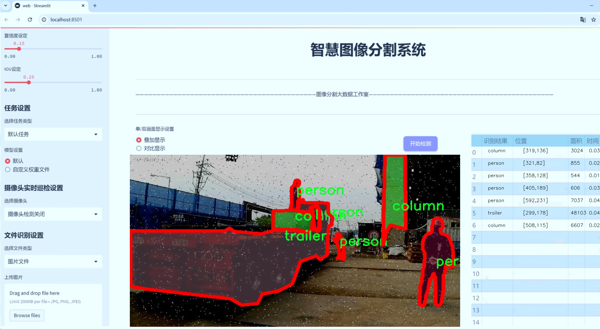
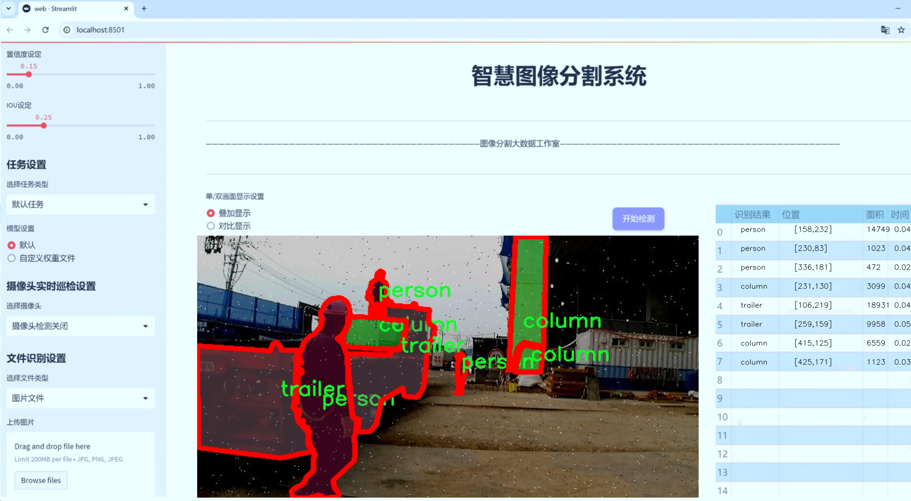
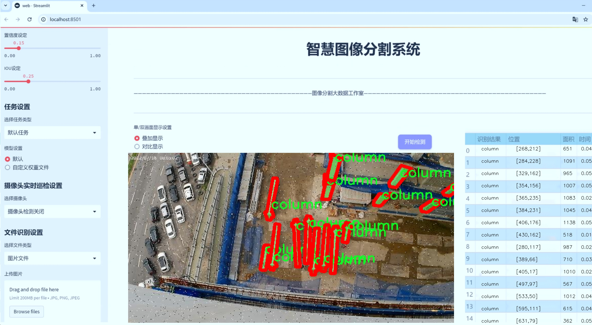
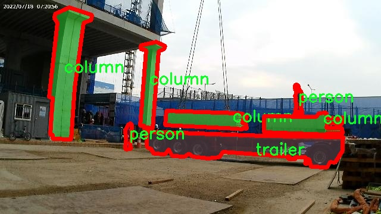
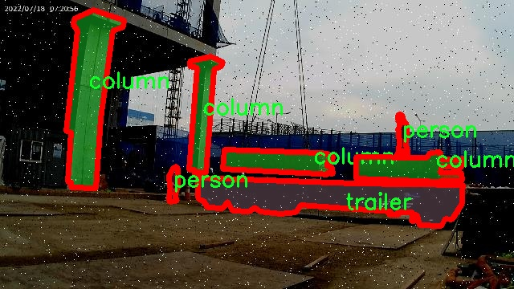
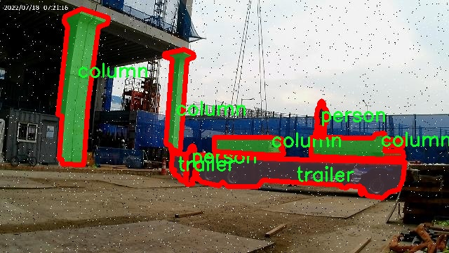
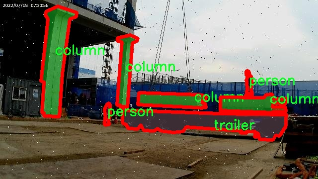
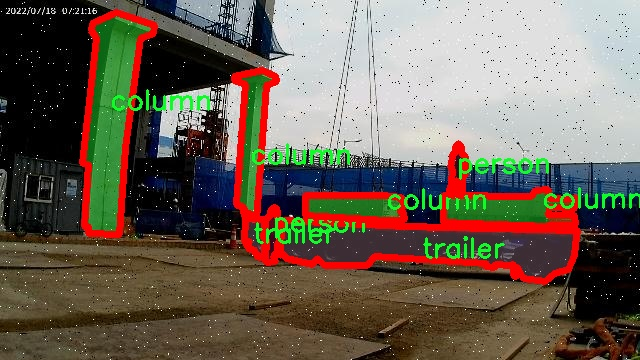

# 建筑结构图像分割系统： yolov8-seg-LSKNet

### 1.研究背景与意义

[参考博客](https://gitee.com/YOLOv8_YOLOv11_Segmentation_Studio/projects)

[博客来源](https://kdocs.cn/l/cszuIiCKVNis)

研究背景与意义

随着城市化进程的加快，建筑行业的快速发展对建筑结构的设计、施工和维护提出了更高的要求。在这一背景下，建筑结构图像的自动化分析与处理逐渐成为研究的热点。图像分割技术作为计算机视觉领域的重要任务之一，能够有效地将图像中的不同对象进行区分和识别，从而为建筑结构的监测、评估和管理提供重要的技术支持。近年来，深度学习技术的飞速发展，尤其是目标检测和实例分割算法的不断优化，使得图像分割在建筑领域的应用前景愈加广阔。

YOLO（You Only Look Once）系列算法因其高效的实时性和较强的检测精度，成为了图像分割领域的重要工具。YOLOv8作为该系列的最新版本，集成了多种先进的特性，如多尺度特征融合和自适应锚框机制，极大地提升了模型在复杂场景下的表现。然而，针对建筑结构图像的特定需求，YOLOv8仍存在一定的局限性，例如在细小结构物体的分割精度和背景复杂场景下的鲁棒性。因此，基于改进YOLOv8的建筑结构图像分割系统的研究显得尤为重要。

本研究将基于PC Dataset数据集进行模型的训练与测试。该数据集包含3800张建筑结构图像，涵盖了6个类别，包括梁、柱、人员、板、拖车和立柱等。这些类别的多样性不仅为模型的训练提供了丰富的样本，也为建筑结构的多维度分析奠定了基础。通过对这些类别的有效分割，可以实现对建筑结构中各个组成部分的精准识别与定位，为后续的结构分析和安全评估提供可靠的数据支持。

在建筑行业中，图像分割技术的应用不仅限于结构的监测与评估，还可以扩展到施工过程中的安全管理、人员监控和设备管理等多个方面。通过对建筑现场的实时监控与分析，能够及时发现潜在的安全隐患，降低事故发生的风险。此外，借助图像分割技术，可以实现对施工进度的动态跟踪，优化资源配置，提高施工效率。因此，基于改进YOLOv8的建筑结构图像分割系统的研究，不仅具有重要的学术价值，也具备广泛的实际应用前景。

综上所述，基于改进YOLOv8的建筑结构图像分割系统的研究，不仅能够推动图像分割技术在建筑领域的应用与发展，还能够为建筑行业的智能化转型提供重要的技术支持。通过提升建筑结构图像的分割精度与效率，能够有效促进建筑安全管理、施工质量控制和资源优化配置，最终实现建筑行业的可持续发展。

### 2.图片演示







注意：本项目提供完整的训练源码数据集和训练教程,由于此博客编辑较早,暂不提供权重文件（best.pt）,需要按照6.训练教程进行训练后实现上图效果。

### 3.视频演示

[3.1 视频演示](https://www.bilibili.com/video/BV1DcUNYtEoS/)

### 4.数据集信息

##### 4.1 数据集类别数＆类别名

nc: 6
names: ['beam', 'column', 'person', 'slab', 'trailer', 'upright']


##### 4.2 数据集信息简介

数据集信息展示

在本研究中，我们使用了名为“PC Dataset”的数据集，旨在训练和改进YOLOv8-seg模型，以实现高效的建筑结构图像分割。该数据集包含六个类别，分别为“beam”（梁）、“column”（柱）、“person”（人）、“slab”（板）、“trailer”（拖车）和“upright”（竖立物体）。这些类别的选择反映了建筑结构中常见的元素和对象，提供了丰富的语义信息，以便于模型在复杂场景中进行准确的分割和识别。

“PC Dataset”中的每个类别都具有独特的特征和形态，这使得模型在学习过程中能够捕捉到不同对象的细微差别。例如，梁和柱作为建筑的主要承重结构，通常呈现出直线形状和坚固的特性，而板则可能具有更为平坦的表面和较大的面积。在数据集中，人物的存在不仅增加了场景的复杂性，还为模型提供了与建筑结构相互作用的上下文信息。此外，拖车和竖立物体的引入，使得模型能够处理更为多样化的场景，提升其在实际应用中的适应能力。

数据集的构建过程经过精心设计，确保了图像的多样性和代表性。每个类别的样本均来自不同的建筑现场，涵盖了各种光照条件、视角和背景。这种多样性不仅有助于模型的泛化能力，还能够有效降低过拟合的风险。为了确保数据的标注质量，所有图像均经过专业人员的仔细标注，确保每个对象的边界清晰且准确。这样的高质量标注为模型的训练提供了坚实的基础，使其能够在复杂的建筑环境中实现精确的分割。

在训练过程中，我们采用了数据增强技术，以进一步丰富数据集的多样性。通过旋转、缩放、翻转和颜色调整等方法，我们能够生成更多的训练样本，从而提高模型的鲁棒性。这些增强技术不仅有助于模型适应不同的输入条件，还能提升其在实际应用中的表现。

此外，数据集的规模也是影响模型性能的重要因素。我们确保“PC Dataset”包含足够数量的样本，以便模型能够学习到每个类别的特征。通过合理的样本分配，我们为每个类别提供了均衡的训练数据，使得模型在各个类别之间的学习能够更加均匀，避免了某些类别因样本不足而导致的识别性能下降。

综上所述，“PC Dataset”不仅为YOLOv8-seg模型的训练提供了丰富的语义信息和多样化的样本，还通过高质量的标注和数据增强技术，确保了模型在建筑结构图像分割任务中的有效性和准确性。随着模型的不断优化和改进，我们期待其在实际应用中能够发挥更大的作用，为建筑行业的智能化发展贡献力量。











### 5.项目依赖环境部署教程（零基础手把手教学）

[5.1 环境部署教程链接（零基础手把手教学）](https://www.bilibili.com/video/BV1jG4Ve4E9t/?vd_source=bc9aec86d164b67a7004b996143742dc)


[5.2 安装Python虚拟环境创建和依赖库安装视频教程链接（零基础手把手教学）](https://www.bilibili.com/video/BV1nA4VeYEze/?vd_source=bc9aec86d164b67a7004b996143742dc)

### 6.手把手YOLOV8-seg训练视频教程（零基础手把手教学）

[6.1 手把手YOLOV8-seg训练视频教程（零基础小白有手就能学会）](https://www.bilibili.com/video/BV1cA4VeYETe/?vd_source=bc9aec86d164b67a7004b996143742dc)


按照上面的训练视频教程链接加载项目提供的数据集，运行train.py即可开始训练



     Epoch   gpu_mem       box       obj       cls    labels  img_size
     1/200     0G   0.01576   0.01955  0.007536        22      1280: 100%|██████████| 849/849 [14:42<00:00,  1.04s/it]
               Class     Images     Labels          P          R     mAP@.5 mAP@.5:.95: 100%|██████████| 213/213 [01:14<00:00,  2.87it/s]
                 all       3395      17314      0.994      0.957      0.0957      0.0843

     Epoch   gpu_mem       box       obj       cls    labels  img_size
     2/200     0G   0.01578   0.01923  0.007006        22      1280: 100%|██████████| 849/849 [14:44<00:00,  1.04s/it]
               Class     Images     Labels          P          R     mAP@.5 mAP@.5:.95: 100%|██████████| 213/213 [01:12<00:00,  2.95it/s]
                 all       3395      17314      0.996      0.956      0.0957      0.0845

     Epoch   gpu_mem       box       obj       cls    labels  img_size
     3/200     0G   0.01561    0.0191  0.006895        27      1280: 100%|██████████| 849/849 [10:56<00:00,  1.29it/s]
               Class     Images     Labels          P          R     mAP@.5 mAP@.5:.95: 100%|███████   | 187/213 [00:52<00:00,  4.04it/s]
                 all       3395      17314      0.996      0.957      0.0957      0.0845


### 7.50+种全套YOLOV8-seg创新点加载调参实验视频教程（一键加载写好的改进模型的配置文件）

[7.1 50+种全套YOLOV8-seg创新点加载调参实验视频教程（一键加载写好的改进模型的配置文件）](https://www.bilibili.com/video/BV1Hw4VePEXv/?vd_source=bc9aec86d164b67a7004b996143742dc)

### YOLOV8-seg算法简介

原始YOLOv8-seg算法原理

YOLOv8-seg作为YOLO系列的最新版本，于2023年1月正式发布，标志着计算机视觉领域在目标检测与实例分割任务上的又一次重要突破。该算法不仅在精度和执行速度上超越了前代模型，还在架构设计和功能实现上进行了全面的创新和优化。YOLOv8-seg的出现，意味着实时目标检测技术的进一步成熟，尤其是在处理复杂场景和小目标检测方面的能力得到了显著提升。

YOLOv8-seg的核心在于其高效的网络结构和先进的特征提取机制。与前几代YOLO模型相比，YOLOv8-seg在骨干网络的设计上进行了重要的改进，采用了新的C2f模块，取代了之前的C3模块。这一变化不仅增加了网络的深度和宽度，还通过引入更多的跳层连接和Split操作，增强了模型的特征表达能力。C2f模块的设计灵感来源于YOLOv7中的E-ELAN结构，旨在通过跨层分支连接改善梯度流，从而提升模型的学习效率和检测性能。

在特征融合方面，YOLOv8-seg继续沿用PAN-FPN结构，利用不同尺度特征图的信息进行有效融合。颈部网络的设计使得模型能够在处理多尺度特征时，保持信息的完整性和准确性。这种特征融合策略使得YOLOv8-seg在面对复杂背景和多样化目标时，依然能够保持高精度的检测能力。

YOLOv8-seg的另一个显著创新是其解耦的检测头设计。与传统的耦合检测头不同，YOLOv8-seg采用了Anchor-Free的检测策略，消除了对先验框的依赖。这一设计使得模型在处理小目标和高分辨率图像时，能够更加灵活和高效。解耦的检测头通过两个并行的卷积分支，分别计算目标的类别和回归损失，从而实现了更为精确的目标定位和分类。这种解耦设计不仅提高了模型的检测速度，还在一定程度上降低了计算复杂度，使得YOLOv8-seg能够在多种硬件平台上高效运行。

此外，YOLOv8-seg在损失函数的设计上也进行了创新，采用了新的损失计算方式，使得模型在训练过程中能够更好地适应不同类型的目标。这一损失函数的优化，结合了YOLOv5的优势，确保了模型在各类数据集上的鲁棒性和泛化能力。通过这些改进，YOLOv8-seg不仅在COCO等标准数据集上取得了优异的表现，还为实际应用提供了强大的支持。

在实际应用中，YOLOv8-seg展现出了卓越的性能，尤其是在垃圾分类、自动驾驶、医疗影像分析等领域。其高效的目标检测和实例分割能力，使得YOLOv8-seg能够快速、准确地识别和定位图像中的各类目标，为相关行业的智能化发展提供了有力的技术支撑。例如，在垃圾分类的应用中，YOLOv8-seg能够迅速识别出不同类型的垃圾，并进行精确的分割，为后续的自动化处理提供了重要的数据支持。

综上所述，YOLOv8-seg算法通过一系列创新和优化，不仅提升了目标检测和实例分割的精度和速度，还在结构设计和功能实现上达到了新的高度。作为YOLO系列的最新成员，YOLOv8-seg无疑将推动计算机视觉技术的进一步发展，并为实际应用带来更为广泛的可能性。随着技术的不断进步，YOLOv8-seg将继续在各个领域发挥其独特的优势，助力智能化时代的到来。


### 9.系统功能展示（检测对象为举例，实际内容以本项目数据集为准）

图9.1.系统支持检测结果表格显示

  图9.2.系统支持置信度和IOU阈值手动调节

  图9.3.系统支持自定义加载权重文件best.pt(需要你通过步骤5中训练获得)

  图9.4.系统支持摄像头实时识别

  图9.5.系统支持图片识别

  图9.6.系统支持视频识别

  图9.7.系统支持识别结果文件自动保存

  图9.8.系统支持Excel导出检测结果数据


### 10.50+种全套YOLOV8-seg创新点原理讲解（非科班也可以轻松写刊发刊，V11版本正在科研待更新）

#### 10.1 由于篇幅限制，每个创新点的具体原理讲解就不一一展开，具体见下列网址中的创新点对应子项目的技术原理博客网址【Blog】：


[10.1 50+种全套YOLOV8-seg创新点原理讲解链接](https://gitee.com/qunmasj/good)

#### 10.2 部分改进模块原理讲解(完整的改进原理见上图和技术博客链接)【如果此小节的图加载失败可以通过CSDN或者Github搜索该博客的标题访问原始博客，原始博客图片显示正常】

### Gold-YOLO简介
YOLO再升级：华为诺亚提出Gold-YOLO，聚集-分发机制打造新SOTA
在过去的几年中，YOLO系列模型已经成为实时目标检测领域的领先方法。许多研究通过修改架构、增加数据和设计新的损失函数，将基线推向了更高的水平。然而以前的模型仍然存在信息融合问题，尽管特征金字塔网络（FPN）和路径聚合网络（PANet）已经在一定程度上缓解了这个问题。因此，本研究提出了一种先进的聚集和分发机制（GD机制），该机制通过卷积和自注意力操作实现。这种新设计的模型被称为Gold-YOLO，它提升了多尺度特征融合能力，在所有模型尺度上实现了延迟和准确性的理想平衡。此外，本文首次在YOLO系列中实现了MAE风格的预训练，使得YOLO系列模型能够从无监督预训练中受益。Gold-YOLO-N在COCO val2017数据集上实现了出色的39.9% AP，并在T4 GPU上实现了1030 FPS，超过了之前的SOTA模型YOLOv6-3.0-N，其FPS相似，但性能提升了2.4%。


#### Gold-YOLO


YOLO系列的中间层结构采用了传统的FPN结构，其中包含多个分支用于多尺度特征融合。然而，它只充分融合来自相邻级别的特征，对于其他层次的信息只能间接地进行“递归”获取。

传统的FPN结构在信息传输过程中存在丢失大量信息的问题。这是因为层之间的信息交互仅限于中间层选择的信息，未被选择的信息在传输过程中被丢弃。这种情况导致某个Level的信息只能充分辅助相邻层，而对其他全局层的帮助较弱。因此，整体上信息融合的有效性可能受到限制。
为了避免在传输过程中丢失信息，本文采用了一种新颖的“聚集和分发”机制（GD），放弃了原始的递归方法。该机制使用一个统一的模块来收集和融合所有Level的信息，并将其分发到不同的Level。通过这种方式，作者不仅避免了传统FPN结构固有的信息丢失问题，还增强了中间层的部分信息融合能力，而且并没有显著增加延迟。


# 8.低阶聚合和分发分支 Low-stage gather-and-distribute branch
从主干网络中选择输出的B2、B3、B4、B5特征进行融合，以获取保留小目标信息的高分辨率特征。


低阶特征对齐模块 (Low-stage feature alignment module)： 在低阶特征对齐模块（Low-FAM）中，采用平均池化（AvgPool）操作对输入特征进行下采样，以实现统一的大小。通过将特征调整为组中最小的特征大小（ R B 4 = 1 / 4 R ） （R_{B4} = 1/4R）（R 
B4 =1/4R），我们得到对齐后的特征F a l i g n F_{align}F align 。低阶特征对齐技术确保了信息的高效聚合，同时通过变换器模块来最小化后续处理的计算复杂性。其中选择 R B 4 R_{B4}R B4 作为特征对齐的目标大小主要基于保留更多的低层信息的同时不会带来较大的计算延迟。
低阶信息融合模块(Low-stage information fusion module)： 低阶信息融合模块（Low-IFM）设计包括多层重新参数化卷积块（RepBlock）和分裂操作。具体而言，RepBlock以F a l i g n ( c h a n n e l = s u m ( C B 2 ， C B 3 ， C B 4 ， C B 5 ) ) F_{align} (channel= sum(C_{B2}，C_{B3}，C_{B4}，C_{B5}))F align (channel=sum(C B2 ，C B3 ，C B4 ，C B5 )作为输入，并生成F f u s e ( c h a n n e l = C B 4 + C B 5 ) F_{fuse} (channel= C_{B4} + C_{B5})F fuse (channel=C B4 +C B5 )。其中中间通道是一个可调整的值（例如256），以适应不同的模型大小。由RepBlock生成的特征随后在通道维度上分裂为F i n j P 3 Finj_P3Finj P 3和F i n j P 4 Finj_P4Finj P 4，然后与不同级别的特征进行融合。


# 8.高阶聚合和分发分支 High-stage gather-and-distribute branch
高级全局特征对齐模块（High-GD）将由低级全局特征对齐模块（Low-GD）生成的特征{P3, P4, P5}进行融合。


高级特征对齐模块(High-stage feature alignment module)： High-FAM由avgpool组成，用于将输入特征的维度减小到统一的尺寸。具体而言，当输入特征的尺寸为{R P 3 R_{P3}R P3 , R P 4 R_{P4}R P4 , R P 5 R_{P 5}R P5 }时，avgpool将特征尺寸减小到该特征组中最小的尺寸（R P 5 R_{P5}R P5  = 1/8R）。由于transformer模块提取了高层次的信息，池化操作有助于信息聚合，同时降低了transformer模块后续步骤的计算需求。

Transformer融合模块由多个堆叠的transformer组成，transformer块的数量为L。每个transformer块包括一个多头注意力块、一个前馈网络（FFN）和残差连接。采用与LeViT相同的设置来配置多头注意力块，使用16个通道作为键K和查询Q的头维度，32个通道作为值V的头维度。为了加速推理过程，将层归一化操作替换为批归一化，并将所有的GELU激活函数替换为ReLU。为了增强变换器块的局部连接，在两个1x1卷积层之间添加了一个深度卷积层。同时，将FFN的扩展因子设置为2，以在速度和计算成本之间取得平衡。

信息注入模块(Information injection module)： 高级全局特征对齐模块（High-GD）中的信息注入模块与低级全局特征对齐模块（Low-GD）中的相同。在高级阶段，局部特征（Flocal）等于Pi，因此公式如下所示：


### 增强的跨层信息流动 Enhanced cross-layer information flow
为了进一步提升性能，从YOLOv8 中的PAFPN模块中得到启发，引入了Inject-LAF模块。该模块是注入模块的增强版，包括了一个轻量级相邻层融合（LAF）模块，该模块被添加到注入模块的输入位置。为了在速度和准确性之间取得平衡，设计了两个LAF模型：LAF低级模型和LAF高级模型，分别用于低级注入（合并相邻两层的特征）和高级注入（合并相邻一层的特征）。它们的结构如图5(b)所示。为了确保来自不同层级的特征图与目标大小对齐，在实现中的两个LAF模型仅使用了三个操作符：双线性插值（上采样过小的特征）、平均池化（下采样过大的特征）和1x1卷积（调整与目标通道不同的特征）。模型中的LAF模块与信息注入模块的结合有效地平衡了准确性和速度之间的关系。通过使用简化的操作，能够增加不同层级之间的信息流路径数量，从而提高性能而不显著增加延迟。


### 11.项目核心源码讲解（再也不用担心看不懂代码逻辑）

#### 11.1 ultralytics\data\utils.py

以下是对代码中最核心部分的提取和详细中文注释：

```python
import os
import hashlib
import numpy as np
from PIL import Image, ImageOps
from ultralytics.utils import check_class_names, yaml_load

IMG_FORMATS = 'bmp', 'jpeg', 'jpg', 'png', 'tif', 'tiff'  # 支持的图像格式

def img2label_paths(img_paths):
    """根据图像路径定义标签路径"""
    sa, sb = f'{os.sep}images{os.sep}', f'{os.sep}labels{os.sep}'  # 图像和标签的子字符串
    return [sb.join(x.rsplit(sa, 1)).rsplit('.', 1)[0] + '.txt' for x in img_paths]

def get_hash(paths):
    """返回路径列表（文件或目录）的单个哈希值"""
    size = sum(os.path.getsize(p) for p in paths if os.path.exists(p))  # 计算文件大小总和
    h = hashlib.sha256(str(size).encode())  # 基于大小生成哈希
    h.update(''.join(paths).encode())  # 基于路径生成哈希
    return h.hexdigest()  # 返回哈希值

def verify_image(im_file):
    """验证单个图像的有效性"""
    nf, nc, msg = 0, 0, ''  # found, corrupt计数和消息
    try:
        im = Image.open(im_file)  # 打开图像文件
        im.verify()  # 验证图像
        shape = im.size  # 获取图像尺寸
        assert (shape[0] > 9) & (shape[1] > 9), f'image size {shape} <10 pixels'  # 确保图像尺寸大于10像素
        assert im.format.lower() in IMG_FORMATS, f'invalid image format {im.format}'  # 检查图像格式
        nf = 1  # 图像有效
    except Exception as e:
        nc = 1  # 图像损坏
        msg = f'WARNING ⚠️ {im_file}: ignoring corrupt image: {e}'  # 错误消息
    return im_file, nf, nc, msg  # 返回图像文件名和计数信息

def check_det_dataset(dataset):
    """
    检查检测数据集的有效性，包括路径和格式。
    如果数据集不存在，尝试下载并解压。
    """
    data = yaml_load(dataset)  # 读取YAML文件
    for k in 'train', 'val':
        if k not in data:
            raise SyntaxError(f"{dataset} '{k}:' key missing ❌.")  # 检查必需的键
    return data  # 返回数据集信息

def compress_one_image(f, f_new=None, max_dim=1920, quality=50):
    """
    压缩单个图像文件，保持其宽高比和质量。
    """
    try:
        im = Image.open(f)  # 使用PIL打开图像
        r = max_dim / max(im.height, im.width)  # 计算缩放比例
        if r < 1.0:  # 如果图像太大
            im = im.resize((int(im.width * r), int(im.height * r)))  # 按比例缩放
        im.save(f_new or f, 'JPEG', quality=quality, optimize=True)  # 保存图像
    except Exception as e:
        print(f'WARNING ⚠️ PIL failure {f}: {e}')  # 错误处理

def autosplit(path, weights=(0.9, 0.1, 0.0)):
    """
    自动将数据集拆分为训练、验证和测试集，并保存到文本文件中。
    """
    files = sorted(x for x in path.rglob('*.*') if x.suffix[1:].lower() in IMG_FORMATS)  # 获取所有图像文件
    n = len(files)  # 文件数量
    indices = random.choices([0, 1, 2], weights=weights, k=n)  # 根据权重分配每个图像到不同的拆分
    # 创建文本文件
    for i, img in TQDM(zip(indices, files), total=n):
        with open(path.parent / f'autosplit_{["train", "val", "test"][i]}.txt', 'a') as f:
            f.write(f'./{img.relative_to(path.parent).as_posix()}\n')  # 将图像路径写入相应的文本文件
```

### 代码核心部分说明：
1. **图像与标签路径转换**：`img2label_paths`函数将图像路径转换为对应的标签路径。
2. **哈希生成**：`get_hash`函数用于生成文件或目录的哈希值，便于数据集的完整性检查。
3. **图像验证**：`verify_image`函数验证图像的有效性，包括格式和尺寸的检查。
4. **数据集检查**：`check_det_dataset`函数检查数据集的结构和必要的键，确保数据集格式正确。
5. **图像压缩**：`compress_one_image`函数用于压缩图像文件，保持其质量和比例。
6. **数据集自动拆分**：`autosplit`函数根据给定的权重将数据集拆分为训练、验证和测试集，并保存路径到文本文件中。

这些核心功能是数据处理和验证的基础，确保在使用YOLO等深度学习模型时，数据集的质量和结构符合要求。

这个文件 `ultralytics\data\utils.py` 是 Ultralytics YOLO 项目中的一个工具模块，主要用于处理与数据集相关的各种操作。该模块包含了多个函数和类，涉及图像和标签的验证、数据集的下载和解析、图像处理等功能。

首先，文件导入了一些必要的库，包括标准库（如 `os`, `hashlib`, `json`, `subprocess`, `time`, `zipfile` 等）和第三方库（如 `cv2`, `numpy`, `PIL` 等）。这些库提供了文件操作、图像处理、数据结构等功能。

文件中定义了一些常量，比如支持的图像和视频格式，以及全局的内存固定设置。这些常量在后续的函数中被用来进行格式验证和内存管理。

接下来，文件定义了一系列函数：

- `img2label_paths(img_paths)`：根据图像路径生成对应的标签路径，假设标签文件与图像文件在不同的子目录中。
- `get_hash(paths)`：计算给定文件或目录路径的哈希值，用于验证文件的一致性。
- `exif_size(img)`：返回经过 EXIF 校正的图像大小，主要用于处理 JPEG 格式的图像。
- `verify_image(args)`：验证单个图像的有效性，包括格式、大小和损坏情况，并返回验证结果。
- `verify_image_label(args)`：验证图像和标签的配对，确保标签文件存在且格式正确。
- `polygon2mask(imgsz, polygons, color, downsample_ratio)`：将多边形转换为二进制掩码，适用于图像分割任务。
- `polygons2masks(imgsz, polygons, color, downsample_ratio)`：将多个多边形转换为多个二进制掩码。
- `find_dataset_yaml(path)`：在指定路径下查找数据集的 YAML 文件，确保只找到一个文件。
- `check_det_dataset(dataset, autodownload=True)`：检查检测数据集的可用性，如果未找到，则下载并解压数据集，同时解析 YAML 文件以获取数据集信息。
- `check_cls_dataset(dataset, split='')`：检查分类数据集的可用性，类似于检测数据集的检查。
- `HUBDatasetStats` 类：用于生成 HUB 数据集的 JSON 文件和目录，提供了处理数据集的多种方法。
- `compress_one_image(f, f_new=None, max_dim=1920, quality=50)`：压缩单个图像文件，保持其宽高比和质量。
- `autosplit(path, weights=(0.9, 0.1, 0.0), annotated_only=False)`：自动将数据集分割为训练、验证和测试集，并保存结果到文本文件中。

这些函数和类共同构成了一个强大的工具集，能够有效地处理数据集的各种需求，包括数据的验证、下载、处理和统计分析。通过这些工具，用户可以方便地管理和使用数据集，为模型训练提供可靠的数据基础。

#### 11.2 ultralytics\engine\tuner.py

以下是经过简化并添加详细中文注释的核心代码部分：

```python
class Tuner:
    """
    负责YOLO模型超参数调优的类。

    该类通过在给定的迭代次数内对YOLO模型的超参数进行变异，并重新训练模型以评估其性能。
    """

    def __init__(self, args=DEFAULT_CFG, _callbacks=None):
        """
        初始化Tuner，配置超参数调优的相关设置。

        参数:
            args (dict, optional): 超参数演化的配置。
        """
        self.args = get_cfg(overrides=args)  # 获取配置
        self.space = {  # 定义超参数搜索空间及其范围
            'lr0': (1e-5, 1e-1),  # 初始学习率范围
            'lrf': (0.0001, 0.1),  # 最终学习率范围
            'momentum': (0.7, 0.98, 0.3),  # 动量范围
            'weight_decay': (0.0, 0.001),  # 权重衰减范围
            # 其他超参数...
        }
        self.tune_dir = get_save_dir(self.args, name='tune')  # 获取保存目录
        self.tune_csv = self.tune_dir / 'tune_results.csv'  # 结果保存的CSV文件路径
        self.callbacks = _callbacks or callbacks.get_default_callbacks()  # 获取回调函数
        LOGGER.info(f"Tuner实例已初始化，保存目录为: {self.tune_dir}")

    def _mutate(self, parent='single', n=5, mutation=0.8, sigma=0.2):
        """
        根据指定的范围和缩放因子变异超参数。

        参数:
            parent (str): 父代选择方法：'single'或'weighted'。
            n (int): 考虑的父代数量。
            mutation (float): 每次迭代中参数变异的概率。
            sigma (float): 高斯随机数生成器的标准差。

        返回:
            (dict): 包含变异后超参数的字典。
        """
        if self.tune_csv.exists():  # 如果CSV文件存在，则选择最佳超参数进行变异
            x = np.loadtxt(self.tune_csv, ndmin=2, delimiter=',', skiprows=1)  # 读取CSV文件
            fitness = x[:, 0]  # 第一列为适应度
            n = min(n, len(x))  # 确定考虑的结果数量
            x = x[np.argsort(-fitness)][:n]  # 选择适应度最高的n个结果
            w = x[:, 0] - x[:, 0].min() + 1E-6  # 计算权重

            # 根据选择方法选择父代
            if parent == 'single' or len(x) == 1:
                x = x[random.choices(range(n), weights=w)[0]]  # 加权选择
            elif parent == 'weighted':
                x = (x * w.reshape(n, 1)).sum(0) / w.sum()  # 加权组合

            # 变异
            r = np.random  # 随机数生成器
            r.seed(int(time.time()))  # 设置随机种子
            g = np.array([v[2] if len(v) == 3 else 1.0 for k, v in self.space.items()])  # 获取增益
            ng = len(self.space)
            v = np.ones(ng)
            while all(v == 1):  # 确保变异发生
                v = (g * (r.random(ng) < mutation) * r.randn(ng) * r.random() * sigma + 1).clip(0.3, 3.0)
            hyp = {k: float(x[i + 1] * v[i]) for i, k in enumerate(self.space.keys())}
        else:
            hyp = {k: getattr(self.args, k) for k in self.space.keys()}  # 初始化超参数

        # 限制超参数在指定范围内
        for k, v in self.space.items():
            hyp[k] = max(hyp[k], v[0])  # 下限
            hyp[k] = min(hyp[k], v[1])  # 上限
            hyp[k] = round(hyp[k], 5)  # 保留五位小数

        return hyp

    def __call__(self, model=None, iterations=10, cleanup=True):
        """
        执行超参数演化过程。

        参数:
           model (Model): 预初始化的YOLO模型。
           iterations (int): 演化的代数。
           cleanup (bool): 是否在调优过程中删除迭代权重以减少存储空间。

        注意:
           该方法利用self.tune_csv路径对象读取和记录超参数及适应度分数。
        """
        t0 = time.time()  # 记录开始时间
        best_save_dir, best_metrics = None, None
        (self.tune_dir / 'weights').mkdir(parents=True, exist_ok=True)  # 创建权重保存目录

        for i in range(iterations):
            mutated_hyp = self._mutate()  # 变异超参数
            LOGGER.info(f'开始第 {i + 1}/{iterations} 次迭代，超参数: {mutated_hyp}')

            metrics = {}
            train_args = {**vars(self.args), **mutated_hyp}  # 合并超参数
            save_dir = get_save_dir(get_cfg(train_args))  # 获取保存目录

            try:
                # 训练YOLO模型
                cmd = ['yolo', 'train', *(f'{k}={v}' for k, v in train_args.items())]
                assert subprocess.run(cmd, check=True).returncode == 0, '训练失败'
                ckpt_file = save_dir / 'weights' / ('best.pt' if (save_dir / 'weights' / 'best.pt').exists() else 'last.pt')
                metrics = torch.load(ckpt_file)['train_metrics']  # 加载训练指标

            except Exception as e:
                LOGGER.warning(f'警告 ❌️ 第 {i + 1} 次超参数调优训练失败\n{e}')

            # 保存结果到CSV
            fitness = metrics.get('fitness', 0.0)
            log_row = [round(fitness, 5)] + [mutated_hyp[k] for k in self.space.keys()]
            headers = '' if self.tune_csv.exists() else (','.join(['fitness'] + list(self.space.keys())) + '\n')
            with open(self.tune_csv, 'a') as f:
                f.write(headers + ','.join(map(str, log_row)) + '\n')

            # 获取最佳结果
            x = np.loadtxt(self.tune_csv, ndmin=2, delimiter=',', skiprows=1)
            fitness = x[:, 0]  # 第一列为适应度
            best_idx = fitness.argmax()  # 找到最佳适应度的索引
            best_is_current = best_idx == i  # 检查当前是否为最佳结果

            if best_is_current:
                best_save_dir = save_dir  # 更新最佳保存目录
                best_metrics = {k: round(v, 5) for k, v in metrics.items()}  # 更新最佳指标
                for ckpt in (save_dir / 'weights').glob('*.pt'):
                    shutil.copy2(ckpt, self.tune_dir / 'weights')  # 复制最佳权重
            elif cleanup:
                shutil.rmtree(ckpt_file.parent)  # 删除迭代权重以减少存储空间

            # 绘制调优结果
            plot_tune_results(self.tune_csv)

            # 保存和打印调优结果
            header = (f'第 {i + 1}/{iterations} 次迭代完成 ✅ ({time.time() - t0:.2f}s)\n'
                      f'结果保存到 {self.tune_dir}\n'
                      f'最佳适应度={fitness[best_idx]} 在第 {best_idx + 1} 次迭代时观察到\n'
                      f'最佳适应度指标为 {best_metrics}\n'
                      f'最佳适应度模型为 {best_save_dir}\n'
                      f'最佳适应度超参数如下:\n')
            LOGGER.info('\n' + header)
            data = {k: float(x[best_idx, i + 1]) for i, k in enumerate(self.space.keys())}
            yaml_save(self.tune_dir / 'best_hyperparameters.yaml', data=data, header=remove_colorstr(header.replace(self.prefix, '# ')) + '\n')
            yaml_print(self.tune_dir / 'best_hyperparameters.yaml')  # 打印最佳超参数
```

### 代码说明
1. **Tuner类**：负责YOLO模型的超参数调优，包含初始化、变异超参数和执行调优的核心方法。
2. **初始化方法**：设置超参数搜索空间、保存目录及回调函数。
3. **_mutate方法**：根据历史记录变异超参数，确保新超参数在指定范围内。
4. **__call__方法**：执行超参数调优的主要流程，包括变异、训练模型、记录结果和更新最佳超参数。

这个程序文件 `ultralytics\engine\tuner.py` 是一个用于超参数调优的模块，专门针对 Ultralytics YOLO 模型进行优化。超参数调优是一个系统化的过程，旨在寻找最佳的超参数组合，以提高模型的性能。在深度学习模型中，尤其是 YOLO，超参数的微小变化可能会导致模型准确性和效率的显著差异。

在文件中，首先导入了一些必要的库，包括随机数生成、文件操作、时间处理、NumPy 和 PyTorch 等。接着，定义了一个 `Tuner` 类，负责 YOLO 模型的超参数调优。该类的主要功能是通过在给定的迭代次数内变异超参数，并重新训练模型来评估其性能。

`Tuner` 类的构造函数接受超参数的配置，并初始化了一些属性，包括超参数的搜索空间、调优结果保存目录和 CSV 文件路径。搜索空间是一个字典，定义了不同超参数的最小值和最大值，以及可选的增益因子。类中还定义了一些方法，其中 `_mutate` 方法用于在指定的边界内变异超参数，而 `__call__` 方法则执行超参数进化过程。

在 `_mutate` 方法中，如果存在先前的调优结果 CSV 文件，程序会选择最佳的超参数进行变异。通过随机选择和加权组合的方式，生成新的超参数，并确保这些超参数在预设的范围内。接着，`__call__` 方法负责执行调优过程，迭代指定次数，每次迭代中加载或初始化超参数，调用 `_mutate` 方法进行变异，并使用变异后的超参数训练 YOLO 模型。训练过程中，程序会记录模型的性能指标，并将结果保存到 CSV 文件中。

在每次迭代结束后，程序会分析当前的最佳结果，并根据需要清理不必要的文件，以节省存储空间。最后，程序还会生成调优结果的可视化图表，并将最佳超参数保存为 YAML 文件，方便后续使用。

总的来说，这个文件实现了一个系统化的超参数调优流程，通过不断变异和训练模型，旨在找到最优的超参数组合，以提升 YOLO 模型在目标检测、实例分割、图像分类等任务中的表现。

#### 11.3 ultralytics\engine\trainer.py

以下是代码中最核心的部分，并附上详细的中文注释：

```python
class BaseTrainer:
    """
    BaseTrainer 类是训练器的基类，负责模型的训练和验证。
    """

    def __init__(self, cfg=DEFAULT_CFG, overrides=None, _callbacks=None):
        """
        初始化 BaseTrainer 类。

        参数:
            cfg (str, optional): 配置文件的路径，默认为 DEFAULT_CFG。
            overrides (dict, optional): 配置覆盖，默认为 None。
        """
        # 获取配置
        self.args = get_cfg(cfg, overrides)
        self.check_resume(overrides)  # 检查是否需要从上次中断的地方恢复训练
        self.device = select_device(self.args.device, self.args.batch)  # 选择训练设备
        self.model = None  # 模型实例
        self.trainset, self.testset = None, None  # 训练集和测试集
        self.best_fitness = None  # 最佳适应度
        self.loss = None  # 当前损失
        self.callbacks = _callbacks or callbacks.get_default_callbacks()  # 回调函数

        # 初始化其他参数
        self.save_dir = get_save_dir(self.args)  # 获取保存结果的目录
        self.wdir = self.save_dir / 'weights'  # 权重保存目录
        self.last, self.best = self.wdir / 'last.pt', self.wdir / 'best.pt'  # 检查点路径
        self.batch_size = self.args.batch  # 批大小
        self.epochs = self.args.epochs  # 训练轮数

        # 设备设置
        if self.device.type in ('cpu', 'mps'):
            self.args.workers = 0  # 在 CPU 上训练时，工作线程数设置为 0

        # 数据集和模型设置
        self.model = self.args.model  # 获取模型
        self.data = check_det_dataset(self.args.data)  # 检查数据集
        self.trainset, self.testset = self.get_dataset(self.data)  # 获取训练集和测试集

    def train(self):
        """开始训练过程。"""
        world_size = len(self.args.device.split(',')) if isinstance(self.args.device, str) else 1  # 获取设备数量

        # 如果是多 GPU 训练，使用 DDP（分布式数据并行）
        if world_size > 1 and 'LOCAL_RANK' not in os.environ:
            cmd, file = generate_ddp_command(world_size, self)  # 生成 DDP 命令
            subprocess.run(cmd, check=True)  # 执行命令
        else:
            self._do_train(world_size)  # 单 GPU 训练

    def _do_train(self, world_size=1):
        """执行训练过程。"""
        self._setup_train(world_size)  # 设置训练参数

        for epoch in range(self.epochs):
            self.model.train()  # 设置模型为训练模式
            for i, batch in enumerate(self.train_loader):  # 遍历训练数据
                self.optimizer.zero_grad()  # 清空梯度
                self.loss, self.loss_items = self.model(batch)  # 前向传播计算损失
                self.loss.backward()  # 反向传播计算梯度
                self.optimizer.step()  # 更新参数

            # 在每个 epoch 结束后进行验证
            self.validate()

    def validate(self):
        """在测试集上进行验证。"""
        metrics = self.validator(self)  # 使用验证器计算指标
        fitness = metrics.pop('fitness', -self.loss.detach().cpu().numpy())  # 获取适应度
        if not self.best_fitness or self.best_fitness < fitness:
            self.best_fitness = fitness  # 更新最佳适应度

    def save_model(self):
        """保存模型的检查点。"""
        ckpt = {
            'epoch': self.epoch,
            'best_fitness': self.best_fitness,
            'model': deepcopy(de_parallel(self.model)).half(),  # 保存模型
            'optimizer': self.optimizer.state_dict(),  # 保存优化器状态
        }
        torch.save(ckpt, self.last)  # 保存最后的检查点
        if self.best_fitness == self.fitness:
            torch.save(ckpt, self.best)  # 保存最佳检查点
```

### 代码核心部分解释：
1. **BaseTrainer 类**：这是一个训练器的基类，负责模型的训练和验证过程。
2. **初始化方法**：在初始化时，获取配置、选择设备、检查数据集、设置训练参数等。
3. **train 方法**：这是训练的入口，判断是否使用多 GPU 训练，并调用相应的训练方法。
4. **_do_train 方法**：实际执行训练的过程，遍历每个 epoch 和每个 batch，进行前向传播、反向传播和参数更新。
5. **validate 方法**：在测试集上进行验证，计算并更新模型的适应度。
6. **save_model 方法**：保存模型的检查点，包括当前 epoch、最佳适应度和优化器状态。

这些核心部分构成了模型训练的基本框架，负责数据的加载、模型的训练、验证和保存。

这个程序文件是Ultralytics YOLO框架中的一个训练器类（`BaseTrainer`），用于在给定的数据集上训练YOLO模型。文件的开头包含了一些基本信息和使用说明，接着导入了所需的库和模块。

`BaseTrainer`类的主要功能是设置训练的各种参数和配置，包括模型、数据集、优化器等。它的构造函数接受配置文件路径和一些覆盖参数，并初始化训练所需的各个组件。初始化过程中，首先通过`get_cfg`函数获取配置参数，然后检查是否需要从上次训练的检查点恢复训练。接着选择训练设备（CPU或GPU），并创建保存结果的目录。

在训练过程中，`train`方法负责处理多GPU训练的情况。如果检测到多个GPU，程序会生成相应的命令并通过子进程运行分布式训练；否则，直接调用`_do_train`方法进行训练。`_do_train`方法则会设置数据加载器和优化器，并在每个训练周期内执行训练步骤。

训练的核心逻辑在`_do_train`方法中实现。它会遍历每个训练周期，并在每个周期内遍历所有的训练批次。在每个批次中，首先会进行前向传播计算损失，然后进行反向传播和优化步骤。训练过程中还会记录损失值、学习率等信息，并在每个周期结束时进行验证和模型保存。

此外，`BaseTrainer`类还提供了一些辅助方法，例如保存模型、加载数据集、设置优化器等。它还实现了回调机制，允许在训练的不同阶段执行自定义操作，比如在每个批次开始或结束时调用特定的回调函数。

总体来说，这个文件实现了YOLO模型训练的主要逻辑，涵盖了模型的初始化、训练过程、验证和模型保存等多个方面，为用户提供了一个灵活且功能强大的训练框架。

#### 11.4 ultralytics\models\sam\modules\decoders.py

以下是代码中最核心的部分，并附上详细的中文注释：

```python
class MaskDecoder(nn.Module):
    """
    MaskDecoder类用于生成掩码及其相关质量分数，使用变换器架构根据图像和提示嵌入预测掩码。
    """

    def __init__(
        self,
        *,
        transformer_dim: int,
        transformer: nn.Module,
        num_multimask_outputs: int = 3,
        activation: Type[nn.Module] = nn.GELU,
        iou_head_depth: int = 3,
        iou_head_hidden_dim: int = 256,
    ) -> None:
        """
        初始化MaskDecoder。

        参数:
            transformer_dim (int): 变换器模块的通道维度
            transformer (nn.Module): 用于预测掩码的变换器
            num_multimask_outputs (int): 预测的掩码数量
            activation (nn.Module): 用于上采样掩码的激活函数类型
            iou_head_depth (int): 用于预测掩码质量的MLP深度
            iou_head_hidden_dim (int): 用于预测掩码质量的MLP隐藏维度
        """
        super().__init__()
        self.transformer_dim = transformer_dim  # 变换器的通道维度
        self.transformer = transformer  # 变换器模块

        self.num_multimask_outputs = num_multimask_outputs  # 多掩码输出数量

        # IoU token的嵌入
        self.iou_token = nn.Embedding(1, transformer_dim)
        self.num_mask_tokens = num_multimask_outputs + 1  # 掩码token数量
        self.mask_tokens = nn.Embedding(self.num_mask_tokens, transformer_dim)  # 掩码token的嵌入

        # 输出上采样网络
        self.output_upscaling = nn.Sequential(
            nn.ConvTranspose2d(transformer_dim, transformer_dim // 4, kernel_size=2, stride=2),
            LayerNorm2d(transformer_dim // 4),
            activation(),
            nn.ConvTranspose2d(transformer_dim // 4, transformer_dim // 8, kernel_size=2, stride=2),
            activation(),
        )
        
        # 生成掩码的超网络MLP
        self.output_hypernetworks_mlps = nn.ModuleList([
            MLP(transformer_dim, transformer_dim, transformer_dim // 8, 3) for _ in range(self.num_mask_tokens)
        ])

        # 预测掩码质量的MLP
        self.iou_prediction_head = MLP(transformer_dim, iou_head_hidden_dim, self.num_mask_tokens, iou_head_depth)

    def forward(
        self,
        image_embeddings: torch.Tensor,
        image_pe: torch.Tensor,
        sparse_prompt_embeddings: torch.Tensor,
        dense_prompt_embeddings: torch.Tensor,
        multimask_output: bool,
    ) -> Tuple[torch.Tensor, torch.Tensor]:
        """
        根据图像和提示嵌入预测掩码。

        参数:
            image_embeddings (torch.Tensor): 图像编码器的嵌入
            image_pe (torch.Tensor): 与image_embeddings形状相同的位置编码
            sparse_prompt_embeddings (torch.Tensor): 点和框的嵌入
            dense_prompt_embeddings (torch.Tensor): 掩码输入的嵌入
            multimask_output (bool): 是否返回多个掩码或单个掩码。

        返回:
            torch.Tensor: 批量预测的掩码
            torch.Tensor: 批量预测的掩码质量
        """
        # 预测掩码和IoU
        masks, iou_pred = self.predict_masks(
            image_embeddings=image_embeddings,
            image_pe=image_pe,
            sparse_prompt_embeddings=sparse_prompt_embeddings,
            dense_prompt_embeddings=dense_prompt_embeddings,
        )

        # 根据是否需要多掩码选择正确的掩码
        mask_slice = slice(1, None) if multimask_output else slice(0, 1)
        masks = masks[:, mask_slice, :, :]
        iou_pred = iou_pred[:, mask_slice]

        return masks, iou_pred  # 返回掩码和IoU预测

    def predict_masks(
        self,
        image_embeddings: torch.Tensor,
        image_pe: torch.Tensor,
        sparse_prompt_embeddings: torch.Tensor,
        dense_prompt_embeddings: torch.Tensor,
    ) -> Tuple[torch.Tensor, torch.Tensor]:
        """
        预测掩码。

        详细信息见'forward'方法。
        """
        # 连接输出tokens
        output_tokens = torch.cat([self.iou_token.weight, self.mask_tokens.weight], dim=0)
        output_tokens = output_tokens.unsqueeze(0).expand(sparse_prompt_embeddings.size(0), -1, -1)
        tokens = torch.cat((output_tokens, sparse_prompt_embeddings), dim=1)

        # 扩展每个图像的数据以适应每个掩码
        src = torch.repeat_interleave(image_embeddings, tokens.shape[0], dim=0)
        src = src + dense_prompt_embeddings  # 添加掩码输入
        pos_src = torch.repeat_interleave(image_pe, tokens.shape[0], dim=0)
        b, c, h, w = src.shape  # 获取形状信息

        # 运行变换器
        hs, src = self.transformer(src, pos_src, tokens)
        iou_token_out = hs[:, 0, :]  # IoU token的输出
        mask_tokens_out = hs[:, 1:(1 + self.num_mask_tokens), :]  # 掩码tokens的输出

        # 上采样掩码嵌入并使用掩码tokens预测掩码
        src = src.transpose(1, 2).view(b, c, h, w)
        upscaled_embedding = self.output_upscaling(src)  # 上采样
        hyper_in_list: List[torch.Tensor] = [
            self.output_hypernetworks_mlps[i](mask_tokens_out[:, i, :]) for i in range(self.num_mask_tokens)
        ]
        hyper_in = torch.stack(hyper_in_list, dim=1)
        masks = (hyper_in @ upscaled_embedding.view(b, c, h * w)).view(b, -1, h, w)  # 生成掩码

        # 生成掩码质量预测
        iou_pred = self.iou_prediction_head(iou_token_out)

        return masks, iou_pred  # 返回掩码和IoU预测
```

### 代码核心部分解释：
1. **MaskDecoder类**：这是一个用于生成掩码的解码器，使用变换器架构来处理图像和提示嵌入。
2. **初始化方法**：定义了各种参数，包括变换器的维度、输出的掩码数量、激活函数、IoU预测的MLP等。
3. **forward方法**：接受图像和提示嵌入，调用`predict_masks`方法来生成掩码和IoU预测，并根据需要选择输出多个掩码或单个掩码。
4. **predict_masks方法**：负责实际的掩码预测，首先连接IoU token和掩码 tokens，然后运行变换器，最后生成掩码和IoU预测。

这个代码的核心功能是通过深度学习模型对图像进行处理，生成相应的掩码和质量预测，适用于计算机视觉任务。

这个程序文件定义了一个名为 `MaskDecoder` 的类，属于深度学习模型的一部分，主要用于生成图像的掩码及其质量评分。该类使用了变换器（transformer）架构来根据图像和提示嵌入（prompt embeddings）预测掩码。

在 `MaskDecoder` 类的构造函数中，初始化了一些重要的属性，包括变换器的维度、变换器模块、要预测的掩码数量、IoU（Intersection over Union）标记的嵌入、掩码标记的嵌入、输出上采样的神经网络序列、用于生成掩码的超网络多层感知机（MLP）列表，以及用于预测掩码质量的MLP。

`forward` 方法是该类的核心功能，接收图像嵌入、位置编码、稀疏提示嵌入和密集提示嵌入等输入，预测掩码和相应的质量评分。根据 `multimask_output` 参数的值，决定返回单个掩码还是多个掩码。

`predict_masks` 方法负责实际的掩码预测。它首先将IoU标记和掩码标记的嵌入连接在一起，并与稀疏提示嵌入进行拼接。接着，将图像嵌入和密集提示嵌入结合，形成输入数据，传入变换器进行处理。变换器的输出包括IoU标记的输出和掩码标记的输出。随后，掩码嵌入经过上采样和超网络MLP处理，最终生成掩码。

此外，文件中还定义了一个 `MLP` 类，用于构建多层感知机模型。该类接受输入维度、隐藏层维度、输出维度和层数等参数，并在前向传播中执行神经网络的前馈操作。可以选择在输出层应用Sigmoid激活函数。

总体而言，这个文件实现了一个复杂的掩码生成模块，结合了变换器架构和多层感知机，适用于图像分割等任务。

#### 11.5 web.py

以下是经过简化并添加详细中文注释的核心代码部分：

```python
import cv2
import numpy as np
from PIL import ImageFont, ImageDraw, Image
from hashlib import md5

def calculate_polygon_area(points):
    """
    计算多边形的面积，输入应为一个 Nx2 的numpy数组，表示多边形的顶点坐标
    """
    if len(points) < 3:  # 多边形至少需要3个顶点
        return 0
    return cv2.contourArea(points)

def draw_with_chinese(image, text, position, font_size=20, color=(255, 0, 0)):
    """
    在OpenCV图像上绘制中文文字
    """
    # 将图像从 OpenCV 格式（BGR）转换为 PIL 格式（RGB）
    image_pil = Image.fromarray(cv2.cvtColor(image, cv2.COLOR_BGR2RGB))
    draw = ImageDraw.Draw(image_pil)
    # 使用指定的字体
    font = ImageFont.truetype("simsun.ttc", font_size, encoding="unic")
    draw.text(position, text, font=font, fill=color)
    # 将图像从 PIL 格式（RGB）转换回 OpenCV 格式（BGR）
    return cv2.cvtColor(np.array(image_pil), cv2.COLOR_RGB2BGR)

def generate_color_based_on_name(name):
    """
    使用哈希函数生成稳定的颜色
    """
    hash_object = md5(name.encode())
    hex_color = hash_object.hexdigest()[:6]  # 取前6位16进制数
    r, g, b = int(hex_color[0:2], 16), int(hex_color[2:4], 16), int(hex_color[4:6], 16)
    return (b, g, r)  # OpenCV 使用BGR格式

def draw_detections(image, info, alpha=0.2):
    """
    在图像上绘制检测结果，包括边界框和类别名称
    """
    name, bbox = info['class_name'], info['bbox']
    x1, y1, x2, y2 = bbox
    # 绘制边界框
    cv2.rectangle(image, (x1, y1), (x2, y2), color=(0, 0, 255), thickness=3)
    # 绘制类别名称
    image = draw_with_chinese(image, name, (x1, y1 - 10), font_size=20)
    return image

def frame_process(image, model, conf_threshold=0.15):
    """
    处理并预测单个图像帧的内容。
    Args:
        image (numpy.ndarray): 输入的图像。
        model: 预训练模型。
        conf_threshold (float): 置信度阈值。
    Returns:
        tuple: 处理后的图像，检测信息。
    """
    # 使用模型进行预测
    pred = model.predict(image)  # 假设模型有predict方法
    detInfo = []  # 存储检测信息

    # 遍历检测到的对象
    for info in pred:
        if info['score'] >= conf_threshold:  # 仅处理高于阈值的检测结果
            image = draw_detections(image, info)  # 绘制检测结果
            detInfo.append(info)  # 添加到检测信息列表

    return image, detInfo

# 实例化并运行应用
if __name__ == "__main__":
    # 假设这里有模型加载和图像读取的代码
    model = None  # 这里应加载实际的模型
    image = cv2.imread("example.jpg")  # 读取示例图像
    processed_image, detections = frame_process(image, model)  # 处理图像
    cv2.imshow("Detections", processed_image)  # 显示结果
    cv2.waitKey(0)
    cv2.destroyAllWindows()
```

### 代码注释说明：
1. **calculate_polygon_area**: 计算多边形的面积，确保至少有三个顶点。
2. **draw_with_chinese**: 在图像上绘制中文文本，使用PIL库处理字体和颜色。
3. **generate_color_based_on_name**: 通过哈希函数生成与名称对应的颜色，确保每个名称对应的颜色一致。
4. **draw_detections**: 在图像上绘制检测结果，包括边界框和类别名称。
5. **frame_process**: 处理图像并进行检测，返回处理后的图像和检测信息。

此代码片段保留了图像处理和检测的核心功能，去除了与用户界面和文件处理相关的部分。

这个程序文件 `web.py` 是一个基于 Streamlit 的图像分割和目标检测系统，主要用于实时视频监控和图像处理。程序中包含了多个功能模块，主要包括图像上传、模型加载、目标检测、结果展示等。

首先，程序导入了一系列必要的库，包括用于图像处理的 OpenCV 和 NumPy、用于创建 Web 应用的 Streamlit、以及用于字体处理的 PIL 库等。接着，定义了一些辅助函数，例如计算多边形面积、在图像上绘制中文文本、生成基于名称的颜色等。这些函数为后续的图像处理和展示提供了基础。

在 `Detection_UI` 类中，初始化了系统的各项参数，包括模型类型、置信度阈值、IOU 阈值、摄像头选择、文件上传等。该类还负责设置页面布局和侧边栏选项，允许用户选择任务类型、上传文件、选择摄像头等。

在处理输入的函数 `process_camera_or_file` 中，程序根据用户选择的输入源（摄像头或文件）进行相应的处理。如果选择了摄像头，程序会使用 OpenCV 捕获视频流，并对每一帧进行目标检测。检测结果会实时显示在界面上，并且可以保存检测结果的图像。如果用户上传了图片或视频文件，程序会读取文件并进行处理，检测结果同样会被展示。

检测过程中的每一帧图像都会调用 `frame_process` 函数，该函数负责对图像进行预处理、模型预测和后处理。检测到的目标会被绘制在图像上，并记录相关信息（如目标名称、边界框、置信度等）。程序还会生成一个表格，展示检测结果，并提供导出功能。

最后，程序通过 `setupMainWindow` 方法构建了主界面，设置了显示模式、进度条和结果表格等元素，并提供了开始检测的按钮。用户可以通过该界面与系统进行交互，实时监控和分析图像数据。

整体来看，这个程序实现了一个功能完整的图像分割和目标检测系统，适用于需要实时监控和分析的场景。

### 12.系统整体结构（节选）

### 程序整体功能和构架概括

该程序是一个基于Ultralytics YOLO框架的深度学习目标检测和图像分割系统。其整体架构由多个模块组成，每个模块负责特定的功能，包括数据处理、模型训练、超参数调优、掩码生成和Web界面展示。程序的主要目标是提供一个高效、灵活的工具，帮助用户进行目标检测和图像分割任务，支持实时视频监控和图像分析。

- **数据处理模块**：负责图像和标签的验证、数据集的下载和解析。
- **训练模块**：实现模型的训练逻辑，包括多GPU支持、损失计算和模型保存。
- **超参数调优模块**：通过变异超参数并评估模型性能，寻找最佳超参数组合。
- **掩码生成模块**：使用变换器架构生成图像的掩码及其质量评分。
- **Web界面模块**：提供用户友好的界面，支持图像上传、实时检测和结果展示。

### 文件功能整理表

| 文件路径                                   | 功能描述                                                                                       |
|--------------------------------------------|-----------------------------------------------------------------------------------------------|
| `ultralytics\data\utils.py`               | 提供数据集处理工具，包括图像和标签验证、数据集下载、图像处理、生成掩码等功能。                         |
| `ultralytics\engine\tuner.py`             | 实现超参数调优，通过变异超参数并训练模型，评估其性能，寻找最佳超参数组合。                             |
| `ultralytics\engine\trainer.py`           | 负责模型的训练逻辑，包括初始化、训练过程、验证和模型保存，支持多GPU训练。                          |
| `ultralytics\models\sam\modules\decoders.py` | 定义掩码解码器，使用变换器架构生成图像的掩码及其质量评分，支持多掩码输出。                           |
| `web.py`                                   | 基于Streamlit构建的Web应用，支持图像上传、实时视频监控、目标检测和结果展示。                         |

这个表格清晰地总结了每个文件的功能，帮助理解程序的整体架构和各个模块之间的关系。

### 13.图片、视频、摄像头图像分割Demo(去除WebUI)代码

在这个博客小节中，我们将讨论如何在不使用WebUI的情况下，实现图像分割模型的使用。本项目代码已经优化整合，方便用户将分割功能嵌入自己的项目中。
核心功能包括图片、视频、摄像头图像的分割，ROI区域的轮廓提取、类别分类、周长计算、面积计算、圆度计算以及颜色提取等。
这些功能提供了良好的二次开发基础。

### 核心代码解读

以下是主要代码片段，我们会为每一块代码进行详细的批注解释：

```python
import random
import cv2
import numpy as np
from PIL import ImageFont, ImageDraw, Image
from hashlib import md5
from model import Web_Detector
from chinese_name_list import Label_list

# 根据名称生成颜色
def generate_color_based_on_name(name):
    ......

# 计算多边形面积
def calculate_polygon_area(points):
    return cv2.contourArea(points.astype(np.float32))

...
# 绘制中文标签
def draw_with_chinese(image, text, position, font_size=20, color=(255, 0, 0)):
    image_pil = Image.fromarray(cv2.cvtColor(image, cv2.COLOR_BGR2RGB))
    draw = ImageDraw.Draw(image_pil)
    font = ImageFont.truetype("simsun.ttc", font_size, encoding="unic")
    draw.text(position, text, font=font, fill=color)
    return cv2.cvtColor(np.array(image_pil), cv2.COLOR_RGB2BGR)

# 动态调整参数
def adjust_parameter(image_size, base_size=1000):
    max_size = max(image_size)
    return max_size / base_size

# 绘制检测结果
def draw_detections(image, info, alpha=0.2):
    name, bbox, conf, cls_id, mask = info['class_name'], info['bbox'], info['score'], info['class_id'], info['mask']
    adjust_param = adjust_parameter(image.shape[:2])
    spacing = int(20 * adjust_param)

    if mask is None:
        x1, y1, x2, y2 = bbox
        aim_frame_area = (x2 - x1) * (y2 - y1)
        cv2.rectangle(image, (x1, y1), (x2, y2), color=(0, 0, 255), thickness=int(3 * adjust_param))
        image = draw_with_chinese(image, name, (x1, y1 - int(30 * adjust_param)), font_size=int(35 * adjust_param))
        y_offset = int(50 * adjust_param)  # 类别名称上方绘制，其下方留出空间
    else:
        mask_points = np.concatenate(mask)
        aim_frame_area = calculate_polygon_area(mask_points)
        mask_color = generate_color_based_on_name(name)
        try:
            overlay = image.copy()
            cv2.fillPoly(overlay, [mask_points.astype(np.int32)], mask_color)
            image = cv2.addWeighted(overlay, 0.3, image, 0.7, 0)
            cv2.drawContours(image, [mask_points.astype(np.int32)], -1, (0, 0, 255), thickness=int(8 * adjust_param))

            # 计算面积、周长、圆度
            area = cv2.contourArea(mask_points.astype(np.int32))
            perimeter = cv2.arcLength(mask_points.astype(np.int32), True)
            ......

            # 计算色彩
            mask = np.zeros(image.shape[:2], dtype=np.uint8)
            cv2.drawContours(mask, [mask_points.astype(np.int32)], -1, 255, -1)
            color_points = cv2.findNonZero(mask)
            ......

            # 绘制类别名称
            x, y = np.min(mask_points, axis=0).astype(int)
            image = draw_with_chinese(image, name, (x, y - int(30 * adjust_param)), font_size=int(35 * adjust_param))
            y_offset = int(50 * adjust_param)

            # 绘制面积、周长、圆度和色彩值
            metrics = [("Area", area), ("Perimeter", perimeter), ("Circularity", circularity), ("Color", color_str)]
            for idx, (metric_name, metric_value) in enumerate(metrics):
                ......

    return image, aim_frame_area

# 处理每帧图像
def process_frame(model, image):
    pre_img = model.preprocess(image)
    pred = model.predict(pre_img)
    det = pred[0] if det is not None and len(det)
    if det:
        det_info = model.postprocess(pred)
        for info in det_info:
            image, _ = draw_detections(image, info)
    return image

if __name__ == "__main__":
    cls_name = Label_list
    model = Web_Detector()
    model.load_model("./weights/yolov8s-seg.pt")

    # 摄像头实时处理
    cap = cv2.VideoCapture(0)
    while cap.isOpened():
        ret, frame = cap.read()
        if not ret:
            break
        ......

    # 图片处理
    image_path = './icon/OIP.jpg'
    image = cv2.imread(image_path)
    if image is not None:
        processed_image = process_frame(model, image)
        ......

    # 视频处理
    video_path = ''  # 输入视频的路径
    cap = cv2.VideoCapture(video_path)
    while cap.isOpened():
        ret, frame = cap.read()
        ......
```


### 14.完整训练+Web前端界面+50+种创新点源码、数据集获取


# [下载链接：https://mbd.pub/o/bread/Z5Wblp9x](https://mbd.pub/o/bread/Z5Wblp9x)